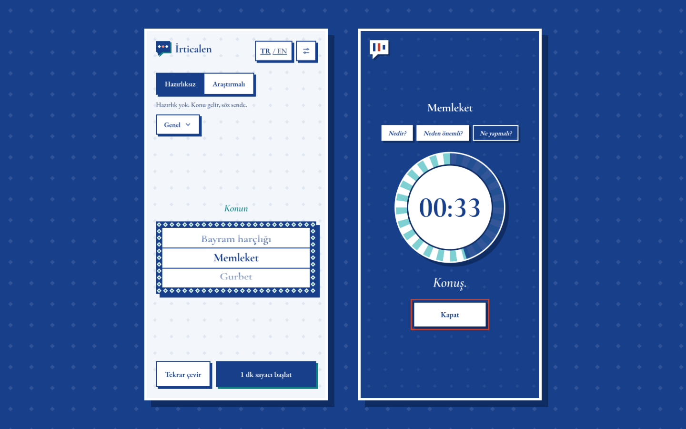

<div align="center">

# İrticalen

**Rastgele konu. Sayaç. Konuş.**

Hazırlıksız konuşma pratiği için küçük, ücretsiz bir web uygulaması.

[**irticalen.yasinozmeen.me**](https://irticalen.yasinozmeen.me) · [English](#english)



</div>

## Nedir?

“İrticalen konuşmak”, hazırlık yapmadan, o an aklına geleni derli toplu söylemek demek. Toplantıda söz sana geldiğinde, mülakatta beklemediğin bir soru sorulduğunda ya da “iki kelime de sen et” dendiğinde ihtiyacın olan beceri bu — ve her beceri gibi tekrarla gelişiyor.

İrticalen o tekrarı kolaylaştırır:

1. Bir kategori seç.
2. **Çevir** — rastgele bir konu gelir: *İlk maaş*, *Bileşik faiz*, *Tutunamayanlar*…
3. Sayacı başlat ve süre bitene kadar konuş.

Takılırsan ekrandaki üç soruyu izle: **Nedir? → Neden önemli? → Ne yapmalı?**

### İki mod

| Mod | Nasıl çalışır |
|---|---|
| **Hazırlıksız** | Konu gelir, sayaç başlar, konuşursun. Düşünme payı yok. |
| **Araştırmalı** | Daha zor bir kavram gelir (*Dunning-Kruger etkisi*, *Mahkûm ikilemi*…). Önce araştırma süresi tutarsın, hazır olunca konuşma sayacını başlatırsın. |

### Neler var, neler yok

- 11 kategoride 260'tan fazla konu; Türkçe liste çeviri değil, buralı: *altın günü*, *esnaf aklı*, *Harf Devrimi*, *Kürk Mantolu Madonna*.
- Türkçe ve İngilizce arayüz.
- Süreler ayarlanabilir (konuşma 1–10 dk, araştırma 1–60 dk). Ses efektleri kapatılabilir.
- Klavyeyle tam kullanım, ekran okuyucu desteği, “hareketi azalt” tercihine saygı.
- **Ses kaydı yok, üyelik yok, çerez yok, izleme yok.** Ayarların yalnızca kendi tarayıcında durur.

## Katkı: konu eklemek

Kod bilmen gerekmiyor. Konular düz JSON dosyalarında:

- Türkçe: [`src/data/topics/tr.json`](src/data/topics/tr.json)
- İngilizce: [`src/data/topics/en.json`](src/data/topics/en.json)

İyi bir konu:

- 1–4 kelimelik bir **kavram** (soru ya da cümle değil): `"Konfor alanı"`, `"İlk müşteri"`.
- En fazla ~28 karakter — ekranda dev puntoyla görünüyor.
- Herkesin üzerine bir-iki dakika konuşabileceği kadar tanıdık.
- Güncel siyaset, din ve kişileri hedef alan konular kabul edilmiyor.

Dosyayı GitHub'da düzenleyip “pull request” açman yeterli.

## Katkı: yeni dil eklemek

1. `src/i18n/tr.ts` dosyasını kopyala (`de.ts` gibi) ve çevir.
2. `src/data/topics/de.json` ile o dilin konu listesini yaz — çeviri yerine o dili konuşanlara tanıdık gelecek konular seç.
3. `src/i18n/index.ts` ve `astro.config.mjs` içindeki dil listesine ekle, `src/pages/de/index.astro` sayfasını oluştur.

## Geliştirme

Node 22+ ve [pnpm](https://pnpm.io) gerekir.

```bash
pnpm install
pnpm dev        # http://localhost:4321
pnpm test       # birim testleri (Vitest)
pnpm run check  # tip denetimi
pnpm build      # statik çıktı → dist/
```

### Yapı

```
src/
  lib/          arayüzden bağımsız mantık: durum makinesi, konu seçici, sayaç, ses, ayarlar (testli)
  components/   Preact bileşenleri
  i18n/         arayüz metinleri (tr, en)
  data/topics/  konu listeleri (tr, en)
  pages/        / (Türkçe) ve /en/ (İngilizce)
docs/SPEC.md    davranış tanımı
```

Teknik tercihler: [Astro](https://astro.build) statik çıktı + tek bir [Preact](https://preactjs.com) adacığı. Her dil hazır HTML olarak üretilir (arama motorları içeriği görür), etkileşimli kısım sonradan canlanır. Ses efektleri Web Audio ile üretilir; ses dosyası yoktur. Sayaç duvar saatine göre çalışır, sekme arka plana gitse de şaşmaz. `main` dalına her gönderimde GitHub Actions testleri çalıştırır ve siteyi GitHub Pages'e yayınlar.

## Teşekkür

Fikir ve akış, [@bitterbuilds](https://www.instagram.com/bitterbuilds/) tarafından yapılan [Unprompted](https://www.unprompted.cool)'dan ilham aldı. İrticalen'in kodu, tasarımı ve konu listeleri sıfırdan yazıldı.

## Lisans

[MIT](LICENSE) © Yasin Özmen

---

<a id="english"></a>

## English

**İrticalen** (Turkish for *extemporaneously*) is a tiny, free impromptu-speaking trainer: pick a category, spin for a random topic, start the timer and talk until it runs out. Stuck? Follow the three prompts on screen: **What? → So what? → Now what?**

- **Off the cuff** — the topic lands and the clock starts.
- **Researched** — a harder concept lands; time your research first, then speak.
- Turkish and English UI, 260+ topics across 11 categories, adjustable timers.
- Fully keyboard accessible, screen-reader friendly, respects reduced motion.
- **No recording, no account, no cookies, no tracking.** Settings live in your browser only.

Try it: [irticalen.yasinozmeen.me/en/](https://irticalen.yasinozmeen.me/en/)

Contributions are welcome — topics live in plain JSON under [`src/data/topics/`](src/data/topics), and adding a language takes one dictionary file, one topic file and one page (see the Turkish section above for the steps).

Inspired by [Unprompted](https://www.unprompted.cool) by [@bitterbuilds](https://www.instagram.com/bitterbuilds/); code, design and topic lists are written from scratch. [MIT](LICENSE) licensed.
